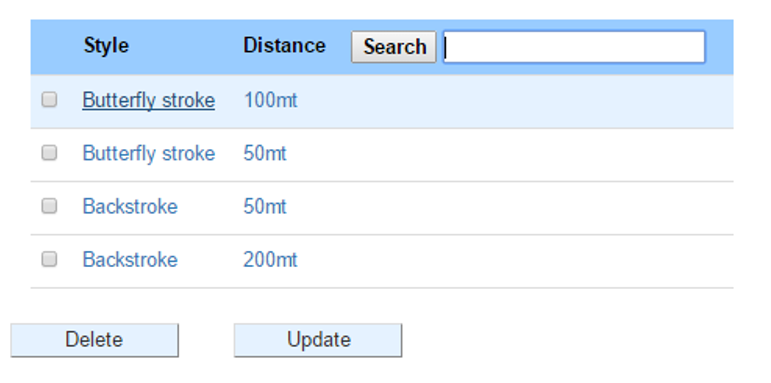
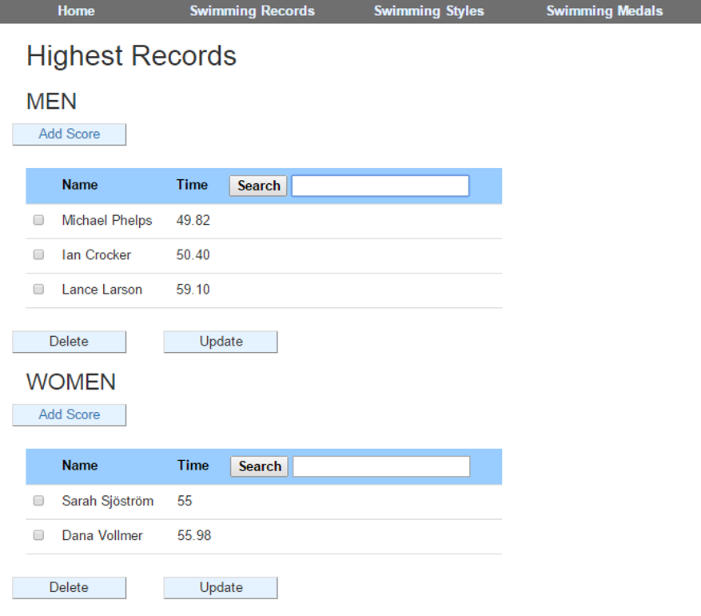
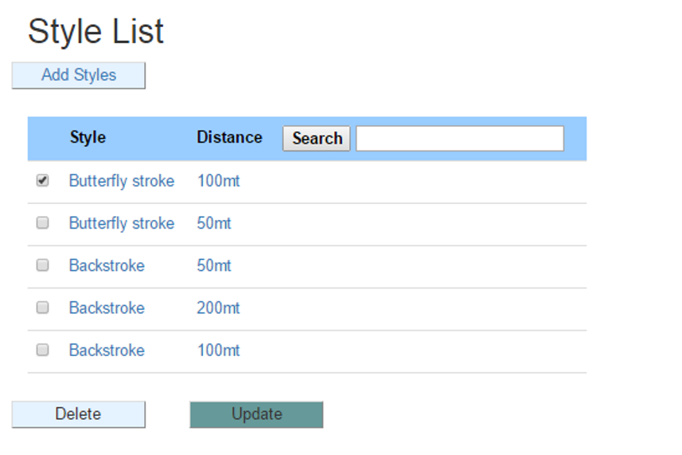
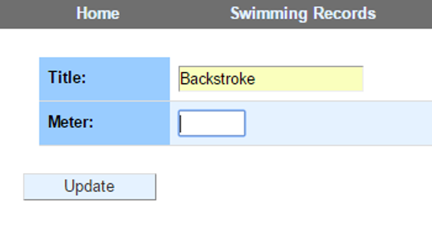

Parts Implemented by Ege Çetindağ
=================================

Styles
======

      When user click the Styles from the navigation bar, style table shows up which is the main table of the swimming styles and

   includes the swimming styles and events(IM) of this styles.

   .. figure:: Ege/Resim1.png
      :height: 900px
      :width: 1300 px
      :scale: 50 %
      :alt: Main

Men and Women High Scores
=========================

      By clicking one of these tuples, person.html is reached. In this html, Men and Women's highest records are

   listed related to swimming types. If "backstroke 50m" is clicked, in person html you can see the highest records in men and women

   for 50m backstroke. Also, the records in this page are sorted by time that the swimmer completed the race in. So, the first person in

   these lists always the person who swam this meter in the shortest time.

+---------+---------+
| |logo1| | |logo2| |
+---------+---------+

      For every table (Style, Men and Women) there are almost same functions which are used to add, delete, update and search.

Add
---

      Add operation can be done by clicking Add buttons which are below every table.

       .. figure:: Ege/Resim6.png
            :width: 90 %
            :scale: 50 %

      When this button is clicked, another html page shows up with text boxes.

      .. figure:: Ege/Resim7.png
            :width: 90 %
            :scale: 50 %

      Input should be written in text boxes and submitted by clicking save button. When it is saved, it automatically returns the tables.

Delete
------

   In order to delete a tuple, after ticking a selectbox in a table, delete button should be clicked.

       .. figure:: Ege/Resim8.png
            :width: 90 %
            :scale: 50 %

      Since in Men and Women tables, foreign key is restrict to the Styles table, If any tuple in Styles table has a child,

   This tuple cannot be deleted before deleting every child whose foreign key shows that tuple. This rule is only valid for Style table

   because men and women tables are referances this table. So, in men and women tables, tuples can be deleted without an error.

      .. figure:: Ege/Resim9.png
           :width: 95 %
           :scale: 50 %

     *A pop up page shows up when it is not allowed to delete the tuple*

Update
------

      To update a tuple, again a selectbox should be selected and submitted by clicking the update button.

    Then textboxes should be filled in the page, and submit button should be clicked. By doing that, id stays still but other attributes are changed.

    Since foreign keys in Men and Women tables are cascaded on update function, no error message shows up. Because ID for the Styles

    table cannot be changed.

+---------+---------+
| |logo1| | |logo2| |
+---------+---------+

Search
------

      For searching a word or part of a word in the tables, search textbox which is next to attributes in the tables,

   can be used. After writing something to this box, search button is clicked.

       .. figure:: Ege/Resim14.png
            :width: 90 %
            :scale: 50 %

      Search function redirects to same html file which is used to show all records for that table. But this time only the related

   results are shown in the tables.

       .. figure:: Ege/Resim15.png
            :width: 90 %
            :scale: 50 %

